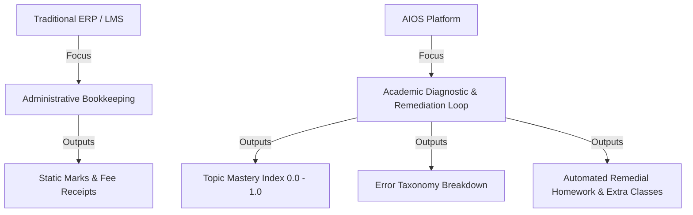
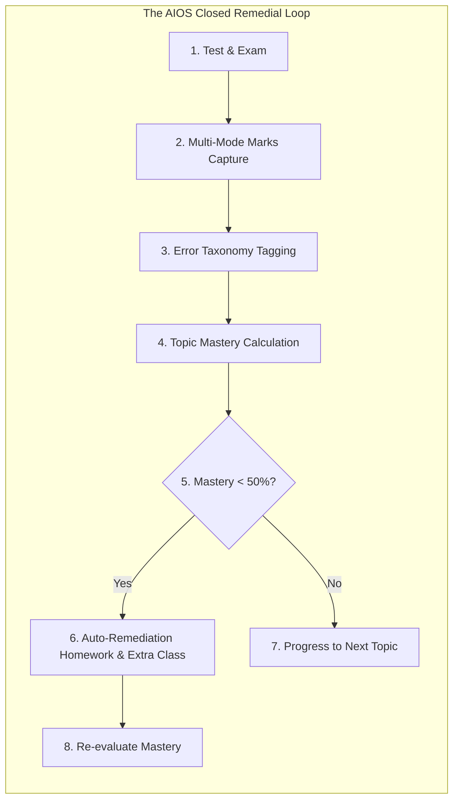
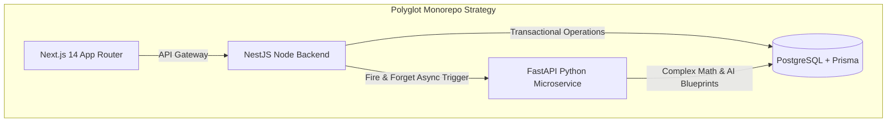
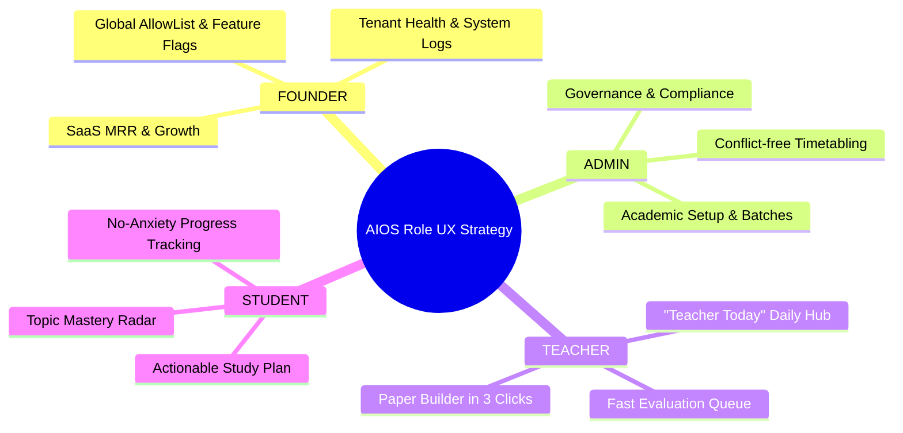
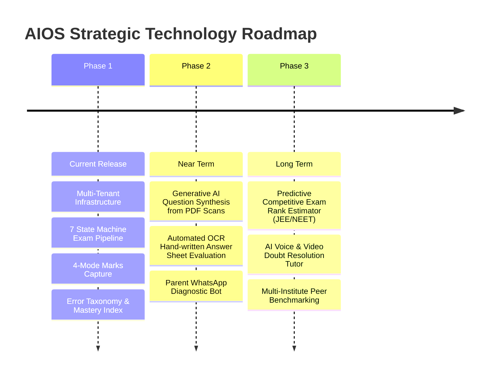

# Product Vision, Philosophy & Strategic Architecture
## AIOS — Academic Intelligence Operating System

**Document Version:** 1.0.0  
**Status:** Strategic Manifesto  
**Date:** August 18, 2026  
**Scope:** Core Aim, Product Philosophy, Architectural Thinking, and Strategic Roadmap  
**Target Repository:** `@[aios]` (`e:\sarvlekh\aios`)

---

## EXECUTIVE SUMMARY & SYSTEM MANIFESTO

Traditional Educational Management Systems (LMS/ERP) are essentially **administrative bookkeeping tools**. They record attendance, store static documents, bill fees, and display plain test marks. They treat education as a passive administrative log rather than a dynamic, continuous learning process.

**AIOS (Academic Intelligence Operating System)** was built to challenge this status quo. 

AIOS operates on a fundamentally different premise: **Education is a diagnostic and corrective loop.** Measuring student scores without diagnosing *why* they lost marks or *which concept failed* is useless. 

AIOS is engineered to be an **Intelligence Layer** that connects testing, error classification, concept mastery calculation, anti-cheating assessment generation, and personalized remediation into one seamless, automated loop.

---

## 1. THE AIM & CORE MISSION

### 1.1 The Fundamental Problem
1. **The Score Illusion**: A score of $70/100$ tells a student they got $70\%$, but it doesn't tell them *where* the $30\%$ was lost. Was it a calculation slip? A misunderstood formula? Or a total lack of conceptual grasp?
2. **Cheating & Test Paper Fatigue**: Coaching institutes spend hundreds of hours manually creating variant sets for physical test halls. Manual paper creation leads to question leaks, improper difficulty distribution, and repetitive test patterns.
3. **Friction in Marks Capture**: Forcing faculty to use rigid online portals when physical paper and OMR sheets are heavily used in real classrooms creates massive friction and delayed results.
4. **Disconnected Remediation**: Weak students are identified *after* final exams when it is already too late. No system automatically generates weak-topic practice assignments immediately after a test is evaluated.

### 1.2 The AIOS Mission
**AIOS aims to democratize hyper-personalized academic intelligence for every coaching institute, school, and educational enterprise.** 

Our mission is to give every teacher an AI co-pilot that generates balanced, anti-cheating test papers in 3 clicks, processes marks from any physical or digital medium, classifies student errors automatically, and delivers automated, topic-specific remedial interventions to every student before the next class.

---

## 2. THE CORE PRODUCT PHILOSOPHY & THINKING

### 2.1 Philosophy 1: Score vs. Diagnostic (Error Taxonomy over Plain Marks)
In AIOS, marks are only the raw input. The true value lies in the **Error Taxonomy**. When a teacher evaluates a paper, AIOS requires or recommends categorizing wrong answers into 6 distinct tags:
- **CONCEPT_ERROR**: Fundamental misunderstanding of the topic.
- **FORMULA_ERROR**: Correct logic, but wrong formula applied.
- **CALCULATION_ERROR**: Correct setup, but arithmetic or algebraic mistake.
- **CARELESS**: Misread the question prompt or selected wrong option key.
- **NOT_ATTEMPTED**: Time crunch or lack of confidence.
- **PRESENTATION_ERROR**: Step formatting or missing scientific units.

*Why this matters:* A student with 10 calculation errors needs speed drills, whereas a student with 10 concept errors needs a re-lecture. Treating them identically is why traditional education fails.

### 2.2 Philosophy 2: Meeting Institutes Where They Are (Zero-Friction Multi-Mode Capture)
We refuse to force institutes to abandon physical paper exams. AIOS supports 4 flexible capture modes:
1. **MANUAL_GRID**: Tabular web key-in for quick digital input.
2. **CSV_IMPORT**: Bulk file upload from external test platforms.
3. **PHOTO_CAPTURE**: High-resolution mobile scans of physical answer sheets for digital grading.
4. **OMR_IMPORT**: Automated ingestion of digital optical mark scanner files.

### 2.3 Philosophy 3: Assessment Integrity & Anti-Cheating by Design
Test papers are the core benchmark of academic quality. AIOS ensures assessment integrity through:
- **AI Blueprint Agent**: Automatically selects questions balancing weightage, topic distribution, and difficulty levels ($EASY$, $MEDIUM$, $HARD$).
- **Multi-Set Variant Generation**: Generates Set A, Set B, Set C with shuffled question order and randomized option positions to eliminate physical copying in exam halls.
- **Strict 7-Stage State Machine**: Exams move through $\text{DRAFT} \rightarrow \text{REVIEW} \rightarrow \text{APPROVED} \rightarrow \text{PUBLISHED} \rightarrow \text{ONGOING} \rightarrow \text{EVALUATING} \rightarrow \text{LOCKED}$. Unlocking a finalized exam requires admin justification and creates an unerasable audit trail record.

### 2.4 Philosophy 4: Continuous Remediation vs. Final Judgment
Instead of using exams to pass or fail students, AIOS uses exams to trigger **Interventions**:
- When a student's topic mastery drops below $0.50$ ($50\%$), AIOS automatically generates a personalized, targeted homework assignment (`Assignment`) focusing specifically on that weak topic.
- The teacher's dashboard automatically groups students with shared topic weaknesses into **Remedial Sessions** or **Extra Classes**.

---

## 3. ARCHITECTURAL & ENGINEERING STRATEGY

### 3.1 Strategy 1: Polyglot Monorepo (NestJS + Python FastAPI)
- **Node.js (NestJS)** handles transactional operations, strict RBAC, database migrations, web requests, domain allowlists, and user management with sub-millisecond execution speeds.
- **Python (FastAPI)** handles heavy mathematical modeling, vector trend calculations, diagnostic algorithms, and AI blueprint test paper generation.
- **Prisma ORM** acts as the single source of truth across both TypeScript (`@prisma/client`) and Python (`prisma-client-py`), ensuring database schema parity.

### 3.2 Strategy 2: Multi-Tenant Isolation with Pre-Approved Allowlisting
Security in AIOS is enforced at the data layer:
- **Tenant Scope**: Every query is isolated by `instituteId`. Cross-tenant data leakage is structurally impossible.
- **Pre-Approved AllowList (`AllowListEntry`)**: Users cannot sign up freely unless their email and role are pre-approved by the Institute Admin or Super Admin.

### 3.3 Strategy 3: Non-Blocking Asynchronous Analytics
Calculating student topic mastery and trend vectors across thousands of questions can be computationally intensive. 
- AIOS isolates evaluation from analytics: when a teacher submits graded marks, NestJS writes the score to PostgreSQL and immediately returns HTTP 200 to the teacher (**<300ms latency**).
- A non-blocking background job triggers the Python analytics service to recalculate topic mastery radar charts and auto-assign weak-topic homework.

### 3.4 Strategy 4: Immutable Audit Ledger
To prevent internal tampering, grade corruption, or unauthorized exam overrides, AIOS includes an unalterable `AuditLog` table. Every administrative override (such as unlocking a locked exam or changing user permissions) records the actor's IP address, user-agent, timestamp, old state, new state, and compulsory reason text.

---

## 4. USER-CENTRIC DESIGN THINKING & ROLE UX

AIOS tailors its interface specifically to the cognitive needs of its 4 user archetypes:

### 4.1 Founder UX (Platform Owner)
- **Core Need**: High-level platform health, SaaS metrics, tenant management.
- **Design Thinking**: Ultra-sleek dark/light dashboard displaying global MRR, server latency spikes, active institute list, feature toggle switches, and security audit logs.

### 4.2 Admin UX (Institute Governance)
- **Core Need**: Operational control without technical complexity.
- **Design Thinking**: Structured management panels for academic hierarchy (`Subject` $\rightarrow$ `Chapter` $\rightarrow$ `Topic`), batch assignments, conflict-free timetable view, notice broadcasts, and formal PDF report card generators.

### 4.3 Teacher UX (Faculty Empowerment)
- **Core Need**: Minimum administrative friction, maximum classroom efficiency.
- **Design Thinking**:
  - **"Teacher Today" Screen**: A single focal point showing today's lectures, pending paper evaluations, and unassigned student doubts.
  - **Paper Builder Studio**: Visual drag-and-drop or AI-guided paper generator that outputs anti-cheating variant sets (Set A/B) instantly.
  - **Evaluation Queue**: High-speed mark entry grid with one-click mistake tagging shortcuts.

### 4.4 Student UX (Learner Growth)
- **Core Need**: Actionable clarity instead of score-induced anxiety.
- **Design Thinking**:
  - **Mastery Radar Chart**: Visual breakdown of strong vs. weak topics instead of a generic total percentage.
  - **Personalized Weak Topic Hub**: Direct links to remediation practice tests, recommended notes, and auto-generated homework.
  - **Leaderboard & Badges**: Positive reinforcement for consistent effort and topic mastery improvement trends ($\Delta M$).

---

## 5. FUTURE ROADMAP & STRATEGIC VISION

AIOS is designed to evolve into a fully autonomous Academic Co-Pilot:

### 5.1 Phase 1 (Current Production Baseline)
- Complete 26-model database schema, multi-tenant isolation, Google SSO allowlisting.
- 48 comprehensive dashboard screens across Founder, Admin, Teacher, and Student roles.
- Python AI Blueprint Agent and async Topic Mastery Engine.

### 5.2 Phase 2 (Near-Term AI Innovations)
- **AI Textbook-to-Question Generator**: Upload any PDF textbook or lecture note to automatically extract questions with LaTeX equations and step-by-step solutions into the question bank.
- **Automated Handwritten OCR Evaluation**: Deep-learning powered handwritten answer sheet grading for photo captures.
- **Parent WhatsApp Intelligence Bot**: Automated weekly WhatsApp diagnostic digest sent directly to guardians, highlighting topic masteries, attendance, and upcoming extra classes.

### 5.3 Phase 3 (Long-Term Academic Intelligence Engine)
- **Predictive Rank Estimation**: Machine learning model analyzing longitudinal topic mastery scores to accurately predict national exam ranks (e.g. JEE Main/Advanced, NEET, SAT, Board Exams).
- **AI Voice & Video Tutor**: Automated interactive video explanations for student doubt tickets generated dynamically by AI faculty avatars.

---

## 6. CONCLUSION & SUMMARY TRACEABILITY

AIOS is not just a software product—it is an **academic philosophy operationalized in code**. By integrating curriculum hierarchy, anti-cheating test creation, flexible marks capture, error taxonomy tagging, and automated remediation into a single monorepo architecture, AIOS empowers educational institutions to deliver measurable student improvement.

| Strategic Pillar | Code Realization | Primary File / Path |
| :--- | :--- | :--- |
| **Multi-Tenancy & Security** | Institute Isolation & AllowList | `@[aios]/packages/db/prisma/schema.prisma` |
| **Error Taxonomy & Capture** | Response Mistake Tags & Capture Modes | `@[aios]/apps/api/src/exams/exams.service.ts` |
| **AI Blueprint Generator** | Python Paper Builder Microservice | `@[aios]/apps/api-python/src/ai/blueprint_agent.py` |
| **User Access Control** | Role-Based Router & Guards | `@[aios]/apps/web/src/app/login/page.tsx` |
| **Dashboard Interface Suites**| 48 Specialized UI Screens | `@[aios]/apps/web/src/components/dashboard/` |

---
*End of Product Vision, Philosophy & Strategic Architecture Document.*
