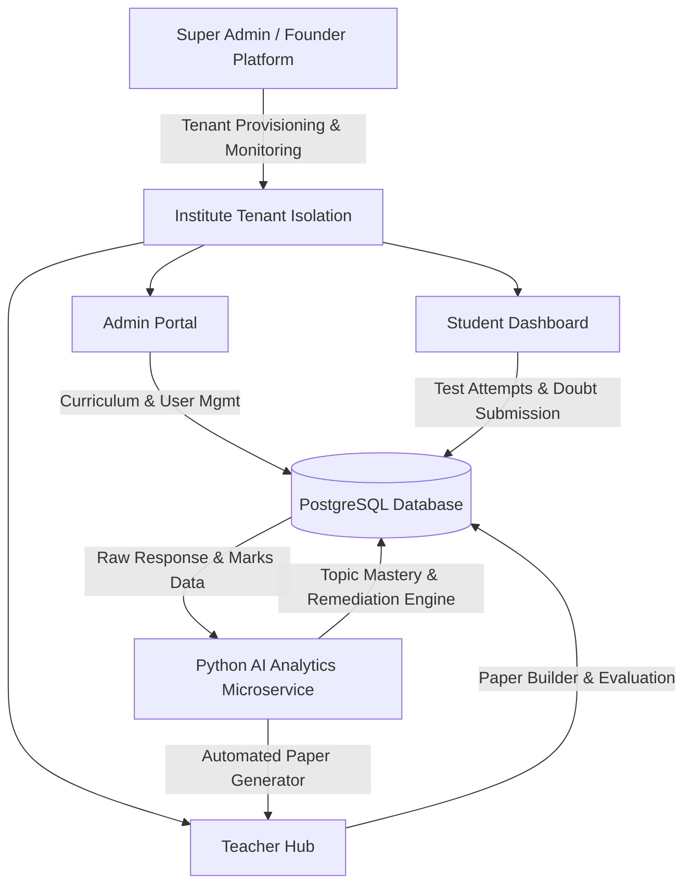
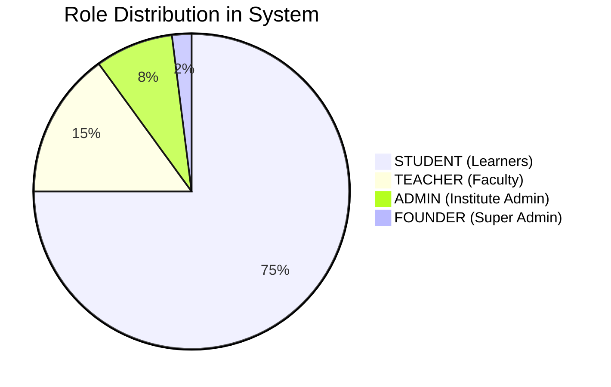
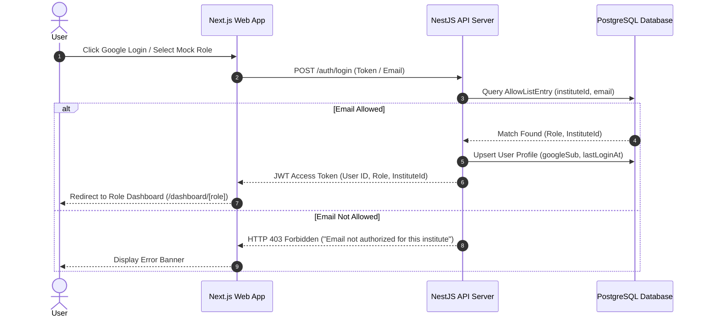
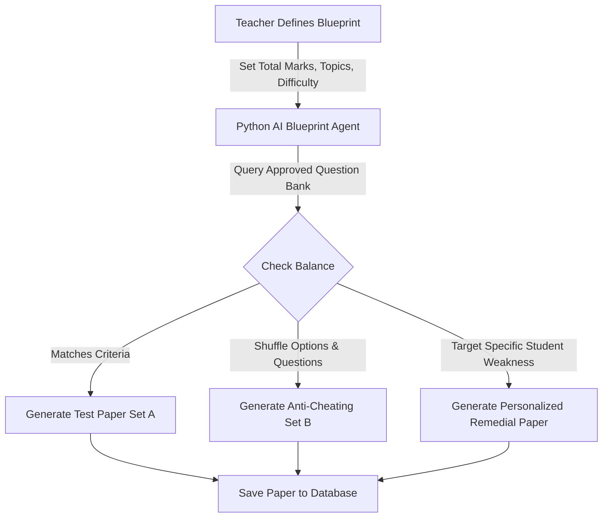
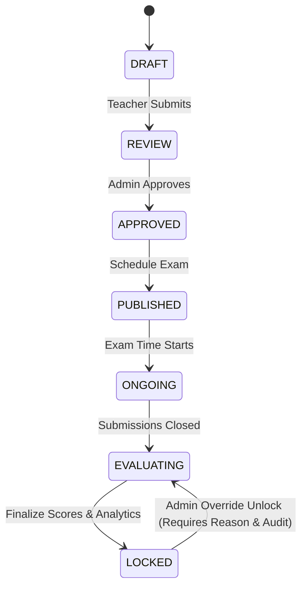
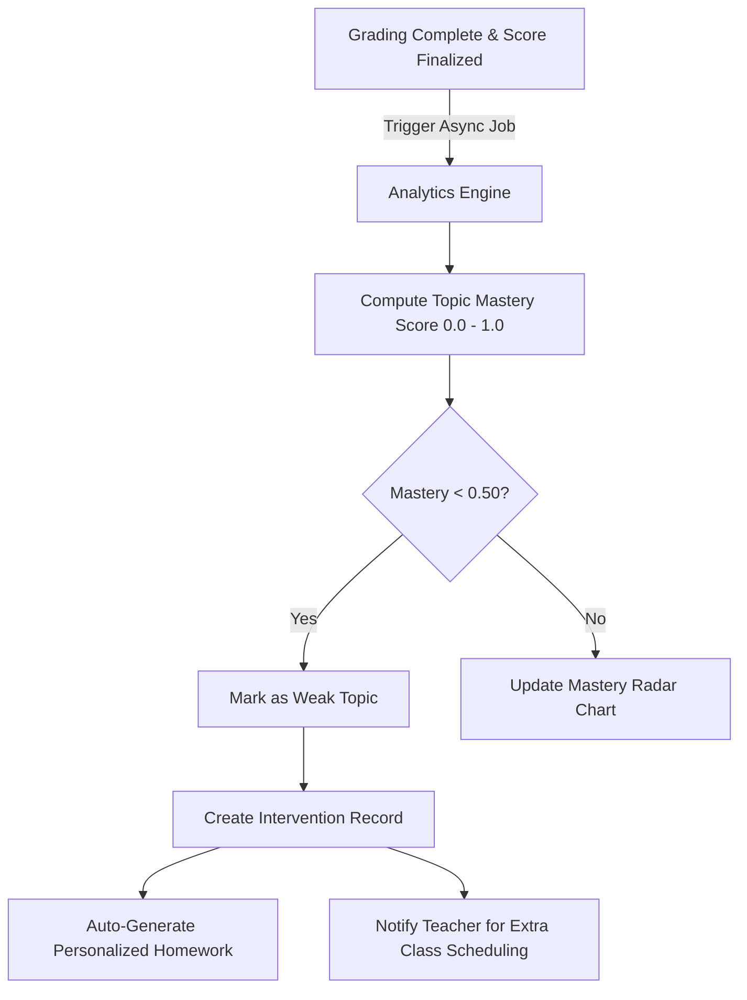
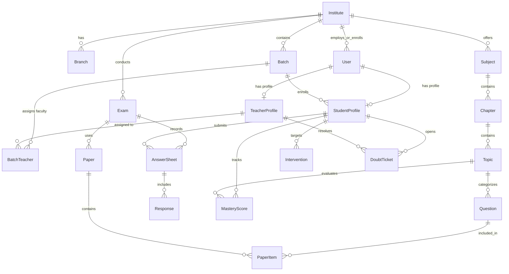

# Software Requirements Specification (SRS)
## AIOS — Academic Intelligence Operating System

**Document Version:** 1.0.0  
**Status:** Approved / Locked  
**Date:** August 18, 2026  
**Application Scope:** Enterprise Multi-Tenant Academic Intelligence SaaS Platform  
**Target Repository:** `@[aios]` (`e:\sarvlekh\aios`)

---

## EXECUTIVE SUMMARY & SYSTEM OVERVIEW

**AIOS (Academic Intelligence Operating System)** is an enterprise-grade, multi-tenant B2B SaaS platform engineered specifically for educational institutions, coaching institutes, schools, and enterprise academic chains. 

The core philosophy of AIOS centers on **Academic Intelligence**: moving beyond simple administrative management (LMS/ERP) into continuous, AI-assisted student performance diagnosis, anti-cheating test paper compilation, multi-channel automated marks capture, error taxonomy tagging, and closed-loop personalized remedial interventions.



---

## 1. INTRODUCTION

### 1.1 Purpose
This Software Requirements Specification (SRS) document provides a complete, detailed specification of the requirements for the **AIOS** platform. It describes the system architecture, monorepo structure, security controls, role-based access models, database schemas, feature workflows, dashboard screens, and non-functional requirements. This document serves as the single source of truth for engineering teams, product managers, quality assurance engineers, and system auditors.

### 1.2 Scope & System Boundaries
AIOS manages the complete lifecycle of educational delivery:
1. **Multi-Tenant Administration**: Domain-allowlisted tenant onboarding, multi-branch hierarchy, pre-approved email access control lists (`AllowListEntry`).
2. **Curriculum Infrastructure**: Three-tier academic hierarchy (`Subject` $\rightarrow$ `Chapter` $\rightarrow$ `Topic`).
3. **Assessment & Question Bank Engine**: 7 question types, LaTeX/Markdown rendering, difficulty scoring, approval workflow, anti-cheating variant set generation (Set A, Set B).
4. **AI Blueprint Agent**: Microservice-driven automated test paper generation balancing weightage, topic coverage, and difficulty curves.
5. **Multi-Mode Marks Capture**: Tabular Manual Grid, CSV Ingestion, Answer-sheet Photo Upload, and Optical Mark Recognition (OMR) scanner file processing.
6. **Error Taxonomy & Diagnostic Engine**: Micro-tagging student errors (`CONCEPT_ERROR`, `FORMULA_ERROR`, `CALCULATION_ERROR`, `CARELESS`, `NOT_ATTEMPTED`, `PRESENTATION_ERROR`).
7. **Real-time Mastery Index & Remediation**: Topic-level mastery score ($0.0 - 1.0$) with trend analysis, automated assignment generation for weak topics, and remedial class scheduling.
8. **Doubt Resolution Pipeline**: Ticketing system with urgency matrix and dedicated faculty queues.
9. **Omnichannel Communication**: In-App, Email, SMS, and WhatsApp notice distribution with delivery and read receipt tracking.
10. **Enterprise Security & Immutable Audit**: Granular audit logging (`AuditLog`) capturing all state modifications across the system.

### 1.3 Definitions, Acronyms, and Abbreviations
| Term | Definition |
| :--- | :--- |
| **AIOS** | Academic Intelligence Operating System |
| **SaaS** | Software as a Service |
| **RBAC** | Role-Based Access Control |
| **OMR** | Optical Mark Recognition |
| **LaTeX** | Standard mathematical syntax renderer |
| **RRULE** | iCal specification standard for recurring timetable slots |
| **Mastery Score** | Calculated float index ($0.0$ to $1.0$) representing a student's conceptual grasp of a topic |
| **Intervention** | Target action (extra class, auto-assignment, remedial group) triggered by low topic mastery |

---

## 2. OVERALL ARCHITECTURE & TECH STACK

### 2.1 Monorepo Breakdown
AIOS is architected as a high-performance monorepo using **pnpm workspaces**:

```
aios/
├── apps/
│   ├── web/           # Next.js 14/15 React Web Application (Port 3000)
│   ├── api/           # NestJS Primary Backend REST API (Port 4000)
│   └── api-python/    # FastAPI Python AI & Analytics Microservice (Port 8000)
├── packages/
│   ├── db/            # Centralized Prisma Database Schema & Client Generator
│   ├── ui/            # Shared UI Design System Tokens & Components
│   └── config/        # Shared ESLint, TypeScript, and Tailwind Configs
├── infra/             # Deployment configurations & environment templates
├── package.json       # Monorepo root configuration
└── pnpm-workspace.yaml# PNPM workspace package boundaries
```

### 2.2 System Component Architecture

```mermaid
graph LR
    subgraph Client Layer
        Web[Next.js App / Tailwind CSS]
    end

    subgraph Node API Layer (NestJS)
        Auth[Auth Module / Google OAuth]
        Inst[Institutes & Users]
        Acad[Academics & Batches]
        Exam[Exams & Papers Engine]
        Capture[Marks Capture & Grading]
        Audit[Audit Logger]
    end

    subgraph AI Service Layer (FastAPI)
        BPAgent[Blueprint Generator]
        Analytics[Mastery & Trend Computation]
        Diag[Weak Topic Diagnostic]
    end

    subgraph Persistence Layer
        DB[(PostgreSQL)]
        Prisma[Prisma Client Node & Py]
    end

    Web -->|HTTP/REST| Auth
    Web -->|HTTP/REST| Exam
    Web -->|HTTP/REST| Capture
    Exam -->|Transaction| DB
    Capture -->|Fire & Forget Async Trigger| Analytics
    Analytics -->|Update Mastery & Interventions| DB
    BPAgent -->|Auto-select Questions| DB
```

### 2.3 Technology Stack Specifications
- **Frontend Framework**: Next.js 14+ (App Router), React 18/19, TypeScript.
- **Styling & UI**: Tailwind CSS, Vanilla CSS custom variables, Lucide React icons, Recharts for analytics visualization, Framer Motion.
- **State Management**: React Context API, Custom Hooks, Zustand store.
- **Primary Backend**: NestJS (Node.js $\ge 20$), TypeScript, `@nestjs/throttler` (rate-limiting), `class-validator`, `zod` schema validation.
- **AI Microservice**: FastAPI (Python 3.11+), Pydantic, Prisma Client Python (`asyncio`).
- **Database & ORM**: PostgreSQL 16+, Prisma ORM (26 Data Models, 890 lines of schema).
- **Authentication**: Google SSO / OAuth 2.0 with stable `googleSub` identifier + Pre-approved Allowlist mechanism.

---

## 3. USER ROLES & PERMISSION MATRIX

AIOS implements a 4-tier strict Role-Based Access Control (RBAC) model:



### 3.1 User Roles Description
1. **FOUNDER (Platform Owner / Super Admin)**
   - Access: System-wide global visibility across all institute tenants.
   - Purpose: Manage SaaS onboarding, institute subscriptions (`TRIAL`, `BASIC`, `PRO`, `ENTERPRISE`), platform health, feature flags, global user management, and platform-wide audit logs.
2. **ADMIN (Institute Administrator)**
   - Access: Institute tenant wide (all branches, batches, users, and subjects under their institute ID).
   - Purpose: Operational governance, batch allocation, teacher/student onboarding, timetable lock management, notice broadcasts, lock/unlock exam overrides, and academic report generation.
3. **TEACHER (Faculty / Educator)**
   - Access: Assigned batches, subjects, and assigned student doubt tickets.
   - Purpose: Conducting daily classes ("Teacher Today"), question authoring, anti-cheating paper generation, multi-mode exam grading, mistake tagging, extra class/remedial scheduling, and student progress monitoring.
4. **STUDENT (Learner)**
   - Access: Self-profile, assigned batch timetable, active exams, homework, personal weak-topic breakdown, doubt submission, and leaderboard.

### 3.2 Role Permission Matrix
| Functional Module | FOUNDER | ADMIN | TEACHER | STUDENT |
| :--- | :---: | :---: | :---: | :---: |
| Tenant & SaaS Subscription Mgmt | **RW** | - | - | - |
| Platform System Health & Logs | **R** | - | - | - |
| User AllowList Management | **RW** | **RW** | - | - |
| Batch & Curriculum Setup | **RW** | **RW** | R | R |
| Question Bank & Approval | **RW** | **RW** | **RW** | - |
| Blueprint & Paper Generation | **RW** | **RW** | **RW** | - |
| Exam Scheduling & Status Change | **RW** | **RW** | **RW** | R |
| Unlock Locked Exam (Requires Reason)| **RW** | **RW** | - | - |
| Marks Capture & Evaluation Queue | **RW** | **RW** | **RW** | - |
| Mistake Tagging & Score Override | **RW** | **RW** | **RW** | - |
| Mastery Index & Diagnostic View | **RW** | **RW** | **RW** | **R (Self)** |
| Remedial / Extra Class Scheduling | **RW** | **RW** | **RW** | R |
| Doubt Ticket Resolution | **RW** | **RW** | **RW (Assigned)**| **Create/Read**|
| Homework Assignment Creation | **RW** | **RW** | **RW** | **Submit** |
| Notice Center Broadcast | **RW** | **RW** | **RW** | R |
| Audit Log Access | **RW (Global)**| **RW (Tenant)**| - | - |

*Legend: **RW** = Read & Write, **R** = Read Only, **-** = No Access.*

---

## 4. FUNCTIONAL REQUIREMENTS & MODULE SPECIFICATIONS

### 4.1 System Foundation & Authentication Module
- **FR-AUTH-01 (Tenant Email Isolation)**: The system shall match incoming user login credentials against pre-approved `AllowListEntry` records for the institute domain.
- **FR-AUTH-02 (Google OAuth 2.0 Integration)**: Secure login using Google SSO storing stable `googleSub` string.
- **FR-AUTH-03 (Tenant Scoping Guard)**: Every API request must pass NestJS auth guards verifying that `actor.instituteId === resource.instituteId` (unless actor role is `FOUNDER`).
- **FR-AUTH-04 (Throttling)**: Auth endpoints shall enforce rate limits of max 10 requests per second and 100 requests per minute to prevent brute-force attacks.



### 4.2 Academic Hierarchy Module
- **FR-ACAD-01 (Taxonomy Setup)**: Admins and Teachers can define a 3-level taxonomy: `Subject` $\rightarrow$ `Chapter` $\rightarrow$ `Topic`.
- **FR-ACAD-02 (Ordering)**: Chapters and Topics must support manual display ordering (`order` field).
- **FR-ACAD-03 (Unique Constraints)**: Subject names must be unique within an institute (`@@unique([instituteId, name])`).

### 4.3 Student Management Module
- **FR-STUD-01 (Student Profile)**: Maintain complete profile including roll number, date of birth, guardian name/contact, address, profile image URL, attached documents (URLs), and status tags.
- **FR-STUD-02 (High-Risk & Remedial Tags)**: Support tagging students with indicators such as `"high-risk"`, `"needs-revision"`, `"fast-learner"`.
- **FR-STUD-03 (Student History Audit Trail)**: Maintain an immutable history record (`StudentHistory`) logging every batch transfer, promotion, tag modification, with timestamp and actor ID.

### 4.4 Teacher Management Module
- **FR-TCHR-01 (Profile & Qualifications)**: Store qualifications, assigned subject IDs array, and weekly availability schedule blocks (`availability` JSON).
- **FR-TCHR-02 (Batch Assignments)**: Map teachers to specific batches and subjects via `BatchTeacher` join model with `assignedAt` and `removedAt` fields.

### 4.5 Question Bank Engine
- **FR-QBANK-01 (Question Types)**: Support 7 rich question types:
  1. `MCQ` (Multiple Choice - Single Correct)
  2. `MULTI_CORRECT` (Multiple Choice - Multi Correct)
  3. `SHORT_ANSWER`
  4. `LONG_ANSWER`
  5. `NUMERICAL` (Exact numeric answer or tolerance range)
  6. `MATCH_THE_FOLLOWING`
  7. `PASSAGE_BASED` (Comprehension linked questions)
- **FR-QBANK-02 (Rich Formatting)**: Question content and solutions must support LaTeX formulas (e.g. `$\int_{0}^{\infty} e^{-x^2} dx$`) and Markdown typography.
- **FR-QBANK-03 (Quality & Approval Pipeline)**: Questions authored by teachers start in `isApproved = false`. Admins/Head Teachers review quality scores (`qualityScore`) and approve (`isApproved = true`, storing `approvedByUserId` and `approvedAt`).
- **FR-QBANK-04 (Version Control)**: Editing an existing question writes an immutable version snapshot into `QuestionVersion`.

### 4.6 Blueprint & Anti-Cheating Paper Generation Engine
- **FR-PAPER-01 (Blueprint Definition)**: Teachers create test templates (`Blueprint`) defining total marks, duration, instructions, and topic distribution matrix (`Json`).
- **FR-PAPER-02 (AI Blueprint Generation Agent)**: Python microservice (`blueprint_agent.py`) evaluates the question bank, selects questions meeting difficulty distributions (`EASY`, `MEDIUM`, `HARD`), ensures topic coverage, and constructs draft test papers.
- **FR-PAPER-03 (Anti-Cheating Set Generation)**: Support generating multiple paper variants (`PaperVersion`: Set A, Set B, Set C) with randomized question sequences and option shuffles for physical classroom administration.
- **FR-PAPER-04 (Personalized Exam Papers)**: Ability to generate targeted test papers tailored to an individual student (`targetStudentId`) based on their specific weak topics.



### 4.7 Exam Management & Multi-Mode Marks Capture
- **FR-EXAM-01 (Lifecycle State Machine)**: Exams transition strictly through 7 sequential states:
  $$\text{DRAFT} \rightarrow \text{REVIEW} \rightarrow \text{APPROVED} \rightarrow \text{PUBLISHED} \rightarrow \text{ONGOING} \rightarrow \text{EVALUATING} \rightarrow \text{LOCKED}$$
- **FR-EXAM-02 (Exam Locking & Override)**: Once an exam enters `LOCKED`, marks cannot be edited unless an Admin executes an unlock operation with a required audit justification reason (`unlockReason`), recorded in `AuditLog`.
- **FR-EXAM-03 (Multi-Mode Capture Engine)**: Support 4 distinct capture modes (`CaptureMode`):
  1. `MANUAL_GRID`: Interactive web grid where teachers input question-by-question marks for a batch.
  2. `CSV_IMPORT`: Structured CSV upload containing Roll Numbers, Question IDs, and Awarded Marks.
  3. `PHOTO_CAPTURE`: Upload of scanned physical answer sheet images for on-screen manual evaluation.
  4. `OMR_IMPORT`: File upload of digital OMR scanner outputs with auto-matching key validation.



### 4.8 Evaluation & Mistake Tagging Engine
- **FR-EVAL-01 (Question-Level Evaluation)**: Capture individual `Response` records for every question attempted by each student.
- **FR-EVAL-02 (Mistake Taxonomy Tagging)**: Teachers assign mistake tags (`MistakeTagType`) during evaluation:
  - `CONCEPT_ERROR`: Student misunderstood core subject concept.
  - `FORMULA_ERROR`: Student applied incorrect mathematical or scientific formula.
  - `CALCULATION_ERROR`: Arithmetic or sign operational mistake.
  - `CARELESS`: Reading error or silly mistake.
  - `NOT_ATTEMPTED`: Question left blank.
  - `PRESENTATION_ERROR`: Incorrect step formatting or units missing.
- **FR-EVAL-03 (Feedback)**: Provide question-level written feedback (`teacherComment`).

### 4.9 Academic Intelligence & Remediation Engine
- **FR-INTEL-01 (Real-time Topic Mastery Calculation)**: Asynchronously calculate topic mastery index ($M \in [0.0, 1.0]$) for each student upon answer sheet submission:
  $$M_{\text{topic}} = \frac{\sum \text{Marks Awarded in Topic}}{\sum \text{Marks Available in Topic}}$$
- **FR-INTEL-02 (Trend Computing)**: Compute vector trend ($\Delta M$) comparing recent attempts against historical averages.
- **FR-INTEL-03 (Diagnostic Diagnostic Engine)**: Flag topics where $M_{\text{topic}} < 0.50$ as `"Critical Weakness"`.
- **FR-INTEL-04 (Automated Interventions)**: Automatically create `Intervention` records and trigger:
  - Auto-generation of targeted weak-topic homework (`Assignment`).
  - Flagging student for Remedial Group / Extra Class session (`EXTRA_CLASS`).



### 4.10 Doubt Resolution Pipeline
- **FR-DOUBT-01 (Doubt Ticket Creation)**: Students create tickets specifying Subject, Topic, Urgency ($1=\text{Low}, 2=\text{Medium}, 3=\text{High}$), textual query, and image attachments.
- **FR-DOUBT-02 (Status Lifecycle)**: $\text{OPEN} \rightarrow \text{ASSIGNED} \rightarrow \text{ANSWERED} \rightarrow \text{CLOSED} \rightarrow \text{ESCALATED}$.
- **FR-DOUBT-03 (Faculty Routing)**: Assign doubts automatically or manually to available batch teachers (`assignedTeacherId`).

### 4.11 Homework & Assignments Module
- **FR-ASGN-01 (Targeting)**: Assignments can be assigned batch-wide (`batchId`) or individually (`studentProfileId`).
- **FR-ASGN-02 (Auto-Generation)**: System auto-generates remedial homework assignments when `isAutoGenerated = true` for students dropping below mastery thresholds.

### 4.12 Timetable & Scheduling Module
- **FR-TIME-01 (Slot Types)**: Support slot classification (`CLASS`, `EXAM`, `REVISION`, `REMEDIAL`, `EXTRA_CLASS`, `BREAK`, `HOLIDAY`).
- **FR-TIME-02 (iCal Recurring Rules)**: Store recurring schedule rules in `recurRule` format (e.g. `FREQ=WEEKLY;BYDAY=MO,WE,FR`).
- **FR-TIME-03 (Conflict Avoidance)**: Validate room availability (`roomRef`) and teacher slot overlap before persisting timetable slots.

### 4.13 Communication & Notice Center
- **FR-COMM-01 (Multi-Channel Dispatch)**: Broadcast notices over 4 channels: `IN_APP`, `EMAIL`, `SMS`, `WHATSAPP`.
- **FR-COMM-02 (Audience Targeting)**: Target specific user roles, batches, or explicit student list (`targetAudience` JSON).
- **FR-COMM-03 (Delivery Receipts)**: Track delivery status per recipient (`QUEUED`, `SENT`, `DELIVERED`, `FAILED`, `READ`).

### 4.14 Reports & Analytics Engine
- **FR-REP-01 (Report Generation)**: Generate formal academic documents (`Report` model):
  - `REPORT_CARD`: End-of-term student mark sheet and rank.
  - `PROGRESS_CARD`: Longitudinal performance line charts and mastery radar.
  - `CLASS_REPORT`: Batch aggregate stats, mean scores, standard deviation.
  - `CHAPTER_REPORT`: Topic-wise breakdown of class strengths and errors.
  - `TEACHER_REPORT`: Grading completion speed, doubts resolved, batch growth.
  - `IMPROVEMENT_SHEET`: Before vs. after mastery measurement post-remedial action.
- **FR-REP-02 (Export Formats)**: Export reports as formatted PDF or Excel sheets (`fileUrl`).

### 4.15 System Audit & Governance Module
- **FR-AUDIT-01 (Immutable Audit Logging)**: Record every administrative or evaluative action (`CREATE`, `UPDATE`, `DELETE`, `APPROVE`, `PUBLISH`, `LOCK`, `UNLOCK`, `ROLE_CHANGE`, `LOGIN_FAILED`).
- **FR-AUDIT-02 (Context Capture)**: Audit records must store `actorId`, `ipAddress`, `userAgent`, `entity`, `entityId`, `oldValue`, and `newValue`.

---

## 5. SCREEN & DASHBOARD INTERFACE SPECIFICATIONS

The application features 4 specialized role-based dashboard suites comprising **48 distinct screen components**:

### 5.1 Admin Dashboard Screens (`apps/web/src/components/dashboard/admin/screens`)
1. **AdminOverview**: Executive KPIs (total students, active teachers, active batches, upcoming exams, attendance rate).
2. **AdminAcademics**: Subjects, Chapters, and Topics taxonomy editor.
3. **AdminStudents**: Student list, roll number assignment, guardian details, and tag filters.
4. **AdminTeachers**: Faculty directory, subject allocation, and availability schedule viewer.
5. **AdminBatches**: Class & section management, academic year assignment, branch allocation.
6. **AdminExams**: Exam master schedule, state machine transitions, paper linkings, and lock overrides.
7. **AdminAttendance**: Institute-wide daily and class-wise attendance grid.
8. **AdminTimetable**: Master schedule calendar view with room and teacher conflict checks.
9. **AdminCommunication**: Notice composition studio, audience selector, channel selection, delivery logs.
10. **AdminAnalytics**: High-level academic performance metrics, batch comparisons, failure warnings.
11. **AdminReports**: Report generation studio for Report Cards, Class Reports, and CSV exports.
12. **AdminAuditLogs**: System security audit trail with filtering by actor, action type, and date range.
13. **AdminSystemSettings**: Institute configuration, domain allowlist management, logo and branding setup.

### 5.2 Teacher Dashboard Screens (`apps/web/src/components/dashboard/teacher/screens`)
1. **TeacherToday**: Daily class hub, upcoming slots, quick attendance launcher, pending evaluations counter.
2. **TeacherClasses**: Assigned batch list, student rosters, subject progress bars.
3. **TeacherTimeTable**: Personal weekly teaching schedule.
4. **TeacherPaperBuilder**: Blueprint setup, question search/filter, paper assembly, variant set generator (Set A/B).
5. **TeacherTestsExams**: Created exam papers, approval status tracking, test publishing.
6. **TeacherEvaluationQueue**: Multi-mode marks capture grid, digital paper review, score entry, mistake tagging.
7. **TeacherDoubtCenter**: Assigned student doubt queue, response writer, image attachment viewer.
8. **TeacherRemedialExtraClass**: Weak topic identifier, student grouping, extra class scheduler.
9. **TeacherAssignments**: Homework builder, auto-assignment generator for weak topics, submission grading.
10. **TeacherAnalytics**: Class mastery radar charts, mistake tag frequency distribution (e.g. calculation vs concept errors).
11. **TeacherReports**: Batch progress report generation and student performance card download.
12. **TeacherSettings**: Faculty profile, subject preferences, availability block editor.

### 5.3 Student Dashboard Screens (`apps/web/src/components/dashboard/student`)
1. **StudentOverview**: Daily agenda, upcoming tests, homework due badges, recent test scores summary.
2. **StudentTimetable**: Personal daily/weekly timetable schedule.
3. **StudentTests**: Scheduled online/offline tests, result history, view graded answer sheets with teacher comments.
4. **StudentPerformance**: Overall percentage, class rank, performance trends across subjects.
5. **StudentProgress**: Subject-wise and chapter-wise progress bars.
6. **StudentWeakTopics**: Personal diagnostic breakdown showing weak topics ($M < 0.50$) with recommended actions.
7. **StudentStudyPlan**: AI-recommended daily revision schedule tailored to weak topics.
8. **StudentAssignments**: Homework list, submission deadline counter, file attachment upload.
9. **StudentDoubtCenter**: Active doubt tickets, status progress, teacher responses.
10. **StudentDoubts**: Quick doubt creation modal with image attachment upload.
11. **StudentExtraClasses**: Scheduled remedial and extra class sessions.
12. **StudentLeaderboard**: Batch/Institute leaderboard displaying top ranks and effort badges.
13. **StudentResources**: Chapter notes, class slides, subject reference documents.
14. **StudentSettings**: Profile details, guardian details, notification preference toggles.

### 5.4 Founder / Platform Owner Screens (`apps/web/src/components/dashboard/founder/screens`)
1. **FounderOverview**: Global SaaS MRR, active institute count, total active users, server health metrics.
2. **FounderInstitutes**: Onboarding wizard, tenant list, plan tier toggle (`TRIAL`, `BASIC`, `PRO`, `ENTERPRISE`), domain allowlists.
3. **FounderSubscriptions**: Billing overview, plan limits, renewal dates, revenue graphs.
4. **FounderUsers**: Platform-wide global user directory, global role assignment, force logout / suspension.
5. **FounderAnalytics**: Cross-tenant platform usage stats, exam volume, active student trends.
6. **FounderFeatureManagement**: System feature flags (toggle OMR capture, toggle AI blueprint agent per tenant).
7. **FounderHealth**: Microservice latency monitor (NestJS API, FastAPI Python, PostgreSQL response time).
8. **FounderIntegrations**: Third-party SMS/WhatsApp gateway keys, S3 storage buckets, Google OAuth credentials.
9. **FounderTickets**: Tenant admin support ticket desk.
10. **FounderAuditLogs**: Global platform security audit log capturing all super admin actions.
11. **FounderSettings**: Global system maintenance mode toggles and default system defaults.

---

## 6. DATABASE SCHEMA & DATA DICTIONARY

The database is built on **PostgreSQL 16** using **Prisma ORM**. It consists of **26 models** and **17 custom enums**.



### 6.1 Data Models Summary
| Model Name | Table Name | Purpose & Description |
| :--- | :--- | :--- |
| `Institute` | `institutes` | Tenant root record holding plan type, status, and domain allowlists. |
| `Branch` | `branches` | Sub-campus locations under an institute tenant. |
| `AllowListEntry` | `allow_list_entries` | Pre-approved email $\rightarrow$ role mapping dictating allowed sign-ins. |
| `User` | `users` | Primary user identity linking Google SSO `googleSub`, email, and role. |
| `StudentProfile` | `student_profiles` | Learner profile with roll number, guardian details, and risk tags. |
| `StudentHistory` | `student_history` | Immutable log of batch transfers, promotions, and tag updates. |
| `TeacherProfile` | `teacher_profiles` | Faculty profile holding qualifications and weekly schedule blocks. |
| `Batch` | `batches` | Class section grouping students for an academic year. |
| `BatchTeacher` | `batch_teachers` | Many-to-many join assigning teachers and subjects to batches. |
| `Subject` | `subjects` | Course subject (e.g., Physics, Mathematics, Chemistry). |
| `Chapter` | `chapters` | Chapter division under a subject. |
| `Topic` | `topics` | Fine-grained learning objective topic under a chapter. |
| `Question` | `questions` | Question bank repository supporting 7 question types and LaTeX content. |
| `QuestionVersion`| `question_versions` | Immutable history of changes to question text and options. |
| `Blueprint` | `blueprints` | Master test pattern defining topic distribution, duration, and marks. |
| `Paper` | `papers` | Assembled test paper instance. |
| `PaperVersion` | `paper_versions` | Anti-cheating paper sets (Set A, Set B) for classroom exams. |
| `PaperItem` | `paper_items` | Question-to-paper mapping with custom order and mark overrides. |
| `Exam` | `exams` | Scheduled test event governed by the 7-stage state machine. |
| `AnswerSheet` | `answer_sheets` | Student submission container for OMR, Photo, or Manual marks. |
| `ScoreRecord` | `score_records` | Aggregated student score, percentage, rank, and finalization status. |
| `Response` | `responses` | Question-level student answer, awarded marks, and mistake tags. |
| `MasteryScore` | `mastery_scores` | Computed topic mastery index ($0.0 - 1.0$) and improvement trend. |
| `Intervention` | `interventions` | Targeted remedial action record (extra class, auto-homework). |
| `TimetableSlot` | `timetable_slots` | Class and exam calendar slots with iCal recurrence support. |
| `DoubtTicket` | `doubt_tickets` | Student academic inquiry ticket assigned to faculty. |
| `Assignment` | `assignments` | Manual or auto-generated weak-topic homework task. |
| `Notice` | `notices` | Broadcast communication message container. |
| `NoticeDelivery` | `notice_deliveries` | Per-user recipient delivery and read status log. |
| `Report` | `reports` | Generated academic PDF/Excel document reference. |
| `AuditLog` | `audit_logs` | Cross-cutting audit record logging every sensitive action. |

---

## 7. EXTERNAL INTERFACES & API ENDPOINTS

### 7.1 NestJS REST API Services (`apps/api`)
- `POST /auth/login` — Authenticate user via OAuth / Mock role token.
- `GET /institutes/me` — Fetch active tenant details and plan permissions.
- `GET /users` — Query tenant user directory (filtered by role, batch).
- `POST /academics/subjects` — Create new subject in curriculum.
- `POST /questions` — Author new question with options and LaTeX explanation.
- `POST /papers/generate-ai` — Proxy request to Python AI Agent for paper build.
- `POST /exams` — Schedule new exam for a batch.
- `PATCH /exams/:id/status` — Transition exam state (e.g. `PUBLISHED` $\rightarrow$ `LOCKED`).
- `POST /exams/:id/unlock` — Admin lock override (requires `unlockReason`).
- `POST /exams/:id/grade-sheet` — Save answer sheet responses & mistake tags.
- `GET /analytics/student/:id/mastery` — Fetch topic mastery radar vector.
- `POST /doubts` — Create new doubt ticket with attachments.
- `POST /notices` — Broadcast notice to channels (Email, In-App, SMS, WhatsApp).

### 7.2 Python FastAPI AI Microservice (`apps/api-python`)
- `POST /ai/generate-blueprint-paper` — Generates optimized question selection balancing weightages and difficulty levels.
- `POST /analytics/recalculate-mastery` — Async worker endpoint re-indexing topic mastery scores and flagging weak topics ($M < 0.50$).
- `POST /analytics/diagnostic-remediation` — Generates customized weak-topic study plans and homework assignments.

---

## 8. NON-FUNCTIONAL REQUIREMENTS

### 8.1 Security & Multi-Tenancy Isolation
1. **Tenant Data Isolation**: All database queries must enforce an `instituteId` condition. No API endpoint may allow cross-tenant data leaks.
2. **Role-Based Authorization**: Every NestJS route handler must be decorated with `@Roles(...)` and guarded by `RolesGuard`.
3. **Audit Trail Immutability**: `AuditLog` table entries can only be inserted, never updated or deleted by normal application roles.
4. **Input Sanitization & Injection Defense**: All request payloads must be parsed via NestJS validation pipes (`class-validator`) and Prisma parameterized queries to prevent SQL and XSS injections.

### 8.2 Performance & Scalability
1. **Async Analytic Processing**: Mastery recalculations and intervention generation must execute asynchronously (`fire-and-forget` background jobs) to ensure HTTP response times for exam grading remain under **300 ms**.
2. **Database Indexing**: Explicit database indexes are applied on high-cardinality foreign keys (`[instituteId, role]`, `[studentProfileId, topicId]`, `[examId, status]`).
3. **Frontend Optimization**: Code-splitting via Next.js App Router, dynamic server component rendering, and asset caching.

### 8.3 Reliability & Governance
1. **State Machine Integrity**: Exam state changes must strictly follow the defined pipeline. Unlocking locked exams requires administrative justification and mandatory audit logging.
2. **Data Integrity**: Foreign key cascade deletes are configured on dependent relations (e.g., deleting an institute cascades to branches and user associations safely).

---

## 9. APPENDIX — FILE LOCATION & MONOREPO TRACEABILITY

| Requirement Module | Primary File / Code Location |
| :--- | :--- |
| **Prisma Database Schema** | `@[aios]/packages/db/prisma/schema.prisma` |
| **NestJS Main App Module** | `@[aios]/apps/api/src/app.module.ts` |
| **Exams & Grading Service** | `@[aios]/apps/api/src/exams/exams.service.ts` |
| **Python AI Agent** | `@[aios]/apps/api-python/src/ai/blueprint_agent.py` |
| **Next.js Login & Role Switcher**| `@[aios]/apps/web/src/app/login/page.tsx` |
| **Admin Dashboard Screens** | `@[aios]/apps/web/src/components/dashboard/admin/screens/` |
| **Teacher Dashboard Screens** | `@[aios]/apps/web/src/components/dashboard/teacher/screens/` |
| **Student Dashboard Screens** | `@[aios]/apps/web/src/components/dashboard/student/` |
| **Founder Dashboard Screens** | `@[aios]/apps/web/src/components/dashboard/founder/screens/` |

---
*End of Software Requirements Specification (SRS) Document.*
